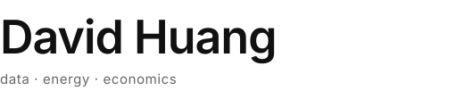

<picture>
  <source media="(prefers-color-scheme: dark)" srcset="./assets/header-dark.svg">
  
</picture>

---

I am a data scientist working in the Low Carbon and Energy Consulting sector. My specialisation is
in timeseries forecasting and techno-econometric analysis. Through circumstances unforeseen -- and
that, frankly, still befuddle me -- I also dabble in data engineering, software development and
(really out of my depth here) thermodynamic modelling.

As the data lead for the Energy Consulting Business Unit at **[Talan UK](https://talan.com)**, my
current focus revolves around the study of the upcoming Home Energy Model (HEM), which I have
recently been fortunate enough to contribute towards (just some bug fixes, but I will take the win),
and the wider integration of innovative data tools into our team's workflow.

Since we are living in 2026, my work also covers the use of agentic AI in research, business
development and service improvement. You can find some of my "adventures" around the subject on this
page. But if you want my honest opinion, I still prefer the good old-fashioned parametric equations
and econometric models for my research. I believe the power of LLMs is better served in our
continuous quest to democratise knowledge (more on that some other time).

Aside from maths and programming, I am an avid writer both at and outside of work. You can find some
of my thoughts on my [substack](https://slotheconomicus.substack.com), or in the policy white papers
I have co-authored, such as [this one](https://bit.ly/3QYvHgb) (my nerdy writings begin on page 14)
presented by the Sustainable Energy Association.

&nbsp;

## Tooling Prototypes

<dl>

<dt><a href="https://github.com/dhfwc18/dbe"><b>dbe</b></a> &nbsp; <kbd>Python</kbd> <kbd>Rust</kbd></dt>
<dd>

David's Basic Economics. My attempt to understand how the PyPI and crate submission processes work,
with a simple repo covering basic microeconomics concepts. QuantEcon folks, if you are watching --
please make a Rust port for your work.

</dd>

<dt><a href="https://github.com/dhfwc18/li-yuan-pipeline"><b>li-yuan-pipeline</b></a> &nbsp; <kbd>Python</kbd> <kbd>Dagster</kbd></dt>
<dd>

My first Dagster prototype. Gotta practice before I put our commercial pipeline on it.

</dd>

<dt><a href="https://github.com/dhfwc18/vibe-code-challenge"><b>vibe-code-challenge</b></a> &nbsp; <kbd>Python</kbd> <kbd>Claude</kbd></dt>
<dd>

An experiment on single-threaded agentic vibe-coding.

</dd>

<dt><a href="https://github.com/dhfwc18/research-team"><b>research-team</b></a> &nbsp; <kbd>Markdown</kbd> <kbd>Claude Code</kbd></dt>
<dd>

Pure markdown for Claude Code agent teams. Wrote an [article] on this one.

</dd>

</dl>

&nbsp;

## Thermodynamic Gems (I am currently using / contributing to)

<dl>

<dt><a href="https://github.com/itt-ustutt/quantity"><b>quantity</b></a> &nbsp; <kbd>Rust</kbd></dt>
<dd>

Can't stress how happy I was to find this one. A real gem -- think `uom` meeting `unyt` and `pint`.

</dd>

<dt><a href="https://github.com/communitiesuk/epb-home-energy-model"><b>Home Energy Model</b></a> &nbsp; <kbd>Rust</kbd> <kbd>Python</kbd></dt>
<dd>

Most of what I do at Talan nowadays. I have built several simplified models and written countless
reports on this one.

</dd>

</dl>

&nbsp;

## Working with

<kbd>Python</kbd> &nbsp; <kbd>Polars</kbd> &nbsp; <kbd>Dagster</kbd> &nbsp;
<kbd>Azure ML</kbd> &nbsp; <kbd>Databricks</kbd> &nbsp; <kbd>T-SQL</kbd> &nbsp;
<kbd>C / C#</kbd> &nbsp; <kbd>Microsoft Fabric</kbd> &nbsp; <kbd>uv</kbd>

&nbsp;

## Elsewhere

[LinkedIn](https://linkedin.com/in/du2021) &nbsp;|&nbsp;
[Email](mailto:dh.fwc18@gmail.com) &nbsp;|&nbsp; London, UK

<em>Open to conversations on energy, sustainability, and applied data science.</em>

[article]: https://slotheconomicus.substack.com/p/programming-economics-and-data-how
